<p align="center">
 
</p>

<br/>

<p align="center">
  
  
  
  
  
  
</p>

<p align="center">
  
  
  
  
  
  
</p>

<br/>

<p align="center">
 ><em>A single-page, backend-free social media platform with a real AI-powered Messenger, a full social graph, a professional analytics dashboard, and a 7-tab settings hub — built entirely on the frontend for the MERN Stack + AI Engineering Bootcamp.</em>
</p>

<p align="center">
  <a href="#-live-demo"><b>Live Demo</b></a> ·
  <a href="#-quick-start"><b>Quick Start</b></a> ·
  <a href="#-feature-tour"><b>Feature Tour</b></a> ·
  <a href="#-ai-features-deep-dive"><b>AI Deep Dive</b></a> ·
  <a href="#-architecture"><b>Architecture</b></a>
</p>

---

## 📌 Live Demo

| Resource | Link |
|---|---|
| 🌐 Live Demo | `<!-- paste your Vercel/Netlify deployment link here -->` |
| 🎥 Loom Walkthrough | `<!-- paste your Loom video link here -->` |
| 💻 Repository | [github.com/AyeshaAbid892/portfolio](https://github.com/AyeshaAbid892) |

> ⚠️ **Deploying your own copy?** The AI features (Messenger suggestions, auto-reply, comment suggestions, post/bio assistants) only work once a `VITE_OPENAI_API_KEY` is set in your environment variables. See [🔐 Security & API Key Setup](#-security--api-key-setup) before you deploy.

---


## 📑 Table of Contents

<table>
<tr>
<td valign="top" width="50%">

| # | Section |
|---|---------|
| 1 | [Overview](#1-overview) |
| 2 | [Requirement Compliance Matrix](#2-requirement-compliance-matrix) |
| 3 | [Tech Stack](#3-tech-stack) |
| 4 | [Live Demo](#4-live-demo) |
| 5 | [Screenshots](#5-screenshots) |
| 6 | [How to Run Locally](#6-how-to-run-locally) |
| 7 | [Architecture & Folder Structure](#7-architecture--folder-structure) |
| 8 | [Data Model — localStorage Schema](#8-data-model--localstorage-schema) |
| 9 | [Route Map](#9-route-map) |
| 10 | [Authentication Flow, Step by Step](#10-authentication-flow-step-by-step) |
| 11 | [Page-by-Page Walkthrough](#11-page-by-page-walkthrough) |
| 12 | [Reusable Component Library](#12-reusable-component-library) |

</td>
<td valign="top" width="50%">

| # | Section |
|---|---------|
| 13 | [Custom Hooks](#13-custom-hooks) |
| 14 | [Bonus Features](#14-bonus-features) |
| 15 | [Code Quality & Engineering Practices](#15-code-quality--engineering-practices) |
| 16 | [Known Limitations](#16-known-limitations) |
| 17 | [What I Learned](#17-what-i-learned) |
| 18 | [Assignment 2 Overview](#18-assignment-2-overview-friends--real-time-chat--ai) |
| 19 | [AI Features — How the OpenAI API Is Used](#19-ai-features--how-the-openai-api-is-used) |
| 20 | [Real-Time Chat Architecture (No Backend)](#20-real-time-chat-architecture-no-backend) |
| 21 | [Setting Up the OpenAI API Key](#21-setting-up-the-openai-api-key) |
| 22 | [Premium Chat Upgrades](#22-premium-chat-upgrades) |
| 23 | [Deliberately Not Implemented — and Why](#23-deliberately-not-implemented--and-why) |

</td>
</tr>
</table>

---


---

## 1. Overview

>**SocialApp** is a Facebook-inspired social media platform built entirely on the **frontend** — no backend server, no Firebase, no Supabase, no external database. Every piece of data (users, posts, comments, likes, friends, chats, notifications, stories, bookmarks) lives in the browser's `localStorage`, read and written through one centralized storage layer: `src/utils/storage.js`.

>The project was built in two phases:

>- **Assignment 1** covers the full core spec — authentication, a public feed, post CRUD with draft/publish states, likes, comments, public profiles, a protected dashboard, and a reusable component library.
>- **Assignment 2** extends it with a **friends network**, **real-time one-to-one chat** (synced live across browser tabs with zero backend), and **AI features powered by the OpenAI API**.

>Nothing from Assignment 1 was rewritten to build Assignment 2 — every new feature lives in its own files and hooks, following the exact same architectural pattern already established.

---

## 2. Requirement Compliance Matrix

>Every row below maps directly to a line item in the assignment brief.

### Core Setup
| Requirement | Status | Where |
|---|---|---|
| React (Vite) project foundation | ✅ | `vite.config.js`, `package.json` |
| React Router v6+ (navigation, dynamic routes, protected routes) | ✅ | `src/App.jsx` |
| Tailwind CSS for all styling | ✅ | `tailwind.config.js`, `src/index.css` |
| React Hook Form for all forms | ✅ | Login, Signup, Create/Edit Post, Profile Settings |
| Context API for auth state | ✅ | `src/context/AuthContext.jsx` |
| `localStorage` for all data | ✅ | `src/utils/storage.js` — the only file that touches `localStorage` |
| `clsx` for conditional classNames | ✅ | `Button.jsx`, `Badge.jsx`, `Toaster.jsx`, and others |
| `React.lazy` + `Suspense` for code-splitting | ✅ | Every route in `App.jsx` is lazy-loaded inside one `Suspense` boundary |
| No Bootstrap / MUI / Ant / jQuery / backend / external DB | ✅ | Verified — none appear in `package.json` or the source |


### Feature Areas
| Area | Marks | Status |
|---|---|---|
| Authentication (signup, login, logout, session persistence) | 10 | ✅ |
| Feed Page (public/draft filtering, guest redirects, empty states) | 8 | ✅ |
| Post Creation (validation, image preview, draft vs. publish) | 12 | ✅ |
| Post Management / Dashboard (CRUD, custom delete modal) | 10 | ✅ |
| Post Detail (like/unlike, comments, ownership checks) | 10 | ✅ |
| Profile Page (cover, avatar, public posts only) | 8 | ✅ |
| Profile Settings (pre-filled form, live bio counter, avatar upload) | 7 | ✅ |
| Protected Routes (`/dashboard/*` guarded both ways) | 5 | ✅ |
| Code Quality (no `var`, no index keys, no mutation) | 10 | ✅ |
| Tailwind CSS (responsive, dark mode) | 5 | ✅ |
| README + Live Demo + Screenshots | 5 | ✅ |

> Everything is functionally complete. The only remaining manual step is pasting your deployed link and screenshots into this README before submission (both sections below are ready — just fill in the blanks).

---


## 3. Tech Stack

| Technology | Version | Purpose |
|---|---|---|
| **React** | 19 | UI library |
| **Vite** | 8 | Build tool / dev server |
| **React Router** | 7 (v6-style API) | Routing, nested routes, protected routes |
| **Tailwind CSS** | 3 | Utility-first styling, dark mode |
| **React Hook Form** | 7 | Form state & validation |
| **Context API** | — | Global authentication state |
| **clsx** | 2 | Conditional className composition |
| **OpenAI SDK** | 6 | Direct browser calls to `gpt-4o-mini` for all AI features |
| **localStorage** | Browser-native | The entire "database" — no server required |

>No backend, no WebSocket library, no external database — every "live" feature (chat, notifications, presence) is built on `localStorage` + the browser's native `storage` event.

---

## 4. Live Demo

>**🔗 Live link:** `<!-- PASTE YOUR DEPLOYED VERCEL/NETLIFY URL HERE -->`

>Deployment notes for whoever reads this next:
>- Deploy the `dist/` output (`npm run build`) to **Vercel** or **Netlify**.
>- Because there is no backend, **no environment variables are required to run the core app** — it works out of the box.
>- To enable the **AI features** on the deployed link, add `VITE_OPENAI_API_KEY` as an environment variable in your hosting provider's dashboard (Vercel → Project → Settings → Environment >Variables), then redeploy. Without it, every other feature (auth, posts, friends, chat) still works perfectly — only the AI panels show a friendly "AI not configured" message.


---

## 5. Screenshots

> Add at least 4–6 screenshots before submitting (Feed, Create Post, Profile, Dashboard, a Chat conversation with AI suggestion chips, and the AI writing assistant in action):

```md


```

---

## 6. How to Run Locally

```bash
git clone <your-repo-url>
cd social-app
npm install
npm run dev
```


>The app opens at `http://localhost:5173`. It runs fully offline once dependencies are installed — no API keys required for the core platform.

```bash
npm run build     # production build → dist/
npm run preview   # preview the production build locally
npm run lint       # run oxlint across src/
```

>To also enable AI features locally, see [§21 — Setting Up the OpenAI API Key](#21-setting-up-the-openai-api-key).

---

## 7. Architecture & Folder Structure


```
social-app/
├── src/
│   ├── components/
│   │   ├── ai/            # AIPostAssistant, AICommentSuggest, AIProfileOptimize
│   │   ├── chat/           # ChatHeader, MessageBubble, TypingIndicator, ReplyPreview,
│   │   │                     MessageActionMenu, ChatProfilePanel, AISuggestionChips…
│   │   ├── friends/         # RelationshipButton (Add/Accept/Reject/Cancel logic)
│   │   ├── layout/            # Navbar, Footer, Sidebar, RightRail, MegaMenu
│   │   ├── post/                # PostCard, PostForm, PostActions, CommentSection
│   │   ├── profile/               # ProfileHeader, AboutSection
│   │   ├── routing/                 # RequireAuth, RedirectIfAuthed guards
│   │   ├── stories/                   # StoriesBar, StoryViewerModal, CreateStoryModal
│   │   └── ui/                          # Button, Input, Modal, Avatar, Badge, Toaster
│   ├── context/
│   │   └── AuthContext.jsx    # signup, login, logout, updateCurrentUser
│   ├── hooks/
│   │   ├── useAuth.js          # useContext(AuthContext) shortcut
│   │   ├── usePosts.js          # centralized post/like/comment/bookmark CRUD
│   │   ├── useLocalStorage.js    # generic state-synced-to-storage hook
│   │   ├── useFriends.js          # friend graph operations
│   │   ├── useNotifications.js     # notification operations
│   │   ├── useStories.js            # story lifecycle + 24h expiry
│   │   ├── useChat.js                 # messages, real-time sync, read receipts
│   │   ├── useChatSettings.js          # per-conversation theme/mute/nickname state
│   │   ├── useNowTick.js                # local re-render tick for typing/online status
│   │   ├── usePresenceHeartbeat.js       # writes "last active" timestamp
│   │   └── useAI.js                       # single gateway to every OpenAI call
│   ├── lib/
│   │   └── openai.js          # one OpenAI client instance, model + token config
│   ├── pages/
│   │   ├── FeedPage.jsx, LoginPage.jsx, SignupPage.jsx, PostDetailPage.jsx,
│   │   │   ProfilePage.jsx, PeoplePage.jsx, FriendsPage.jsx, ChatPage.jsx,
│   │   │   NotificationsPage.jsx, SettingsPage.jsx, NotFoundPage.jsx …
│   │   └── dashboard/
│   │       ├── DashboardLayout.jsx, PostsDashboard.jsx, CreatePost.jsx,
│   │       │   EditPost.jsx, SavedPosts.jsx, ProfileSettings.jsx
│   ├── utils/
│   │   ├── storage.js      # the single gateway to localStorage
│   │   ├── helpers.js       # generateId, formatDate, etc.
│   │   ├── toastBus.js       # tiny pub-sub for toast notifications
│   │   ├── chatBus.js          # tiny pub-sub for same-tab chat updates
│   │   ├── chatHelpers.js       # getConversationId, message formatting
│   │   └── seedDemoData.js       # optional demo users/posts for first run
│   ├── App.jsx              # every route, all lazy-loaded
│   └── main.jsx               # BrowserRouter + AuthProvider root
├── docs/                       # README banner assets
├── .env.example                 # OpenAI key template (copy to .env)
├── tailwind.config.js
└── vite.config.js
```

>**Design principle:** every component that needs data calls a **hook** (`usePosts`, `useAuth`, `useChat`, `useAI`…), never `localStorage` or the OpenAI SDK directly. Every hook calls **`storage.js`** (or, for AI, **`useAI.js` → `lib/openai.js`**) and nothing else does. This one-way dependency chain — `component → hook → storage.js / lib/openai.js` — is what keeps the codebase testable, and makes it trivial to later swap `localStorage` for a real API, since only `storage.js` would need to change.


---

## 8. Data Model — localStorage Schema

```js
// Key: 'users'
{
  id: 'usr_1703001234_abc',
  name: 'Asad Khan',
  email: 'asad@test.com',
  password: 'Password123',   // demo-only — see Known Limitations
  bio: 'React developer from Lahore',
  location: 'Lahore, Pakistan',
  avatar: 'data:image/jpeg;base64,...',
  coverImage: 'data:image/jpeg;base64,...',
  joinedAt: '2025-01-15T10:00:00Z',
  onboarded: true,
}

// Key: 'posts'
{
  id: 'post_1703001234_xyz',
  authorId: 'usr_1703001234_abc',
  description: 'Hello everyone!',
  image: 'data:image/jpeg;base64,...',
  isPublic: true,
  isDraft: false,
  createdAt: '2025-01-15T10:00:00Z',
  updatedAt: '2025-01-15T10:00:00Z',
}

// Key: 'comments'  → { id, postId, authorId, text, createdAt }
// Key: 'likes'     → { id, postId, userId, createdAt }
```

>Every feature area adds its own namespaced key the same way — **all read/written exclusively through `storage.js`**:


| Feature | Keys |
|---|---|
| Friends | `friends`, `friendRequests` |
| Chat | `messages`, `chatThemes`, `aiSettings` |
| Social extras | `notifications`, `stories`, `bookmarks` |

---

## 9. Route Map

| Route | Access | Page |
|---|---|---|
| `/` | Public | FeedPage |
| `/login`, `/signup`, `/forgot-password` | Public (redirects to `/dashboard` if already logged in) | Login / Signup / ForgotPassword |
| `/onboarding` | Protected | First-login profile setup |
| `/posts/:postId` | Public | PostDetailPage |
| `/profile/:userId` | Public | ProfilePage |
| `/search` | Protected | SearchResultsPage |
| `/people` | Protected | PeoplePage (People You May Know) |
| `/friends`, `/friend-requests` | Protected | FriendsPage, FriendRequestsPage |
| `/chat`, `/chat/:userId` | Protected | ChatPage |
| `/notifications` | Protected | NotificationsPage |
| `/settings` | Protected | SettingsPage |
| `/professional-dashboard` | Protected | ProfessionalDashboardPage |
| `/dashboard/posts` | Protected | PostsDashboard |
| `/dashboard/create` | Protected | CreatePost |
| `/dashboard/edit/:postId` | Protected | EditPost |
| `/dashboard/saved` | Protected | SavedPosts |
| `/dashboard/settings` | Protected | ProfileSettings |
| `/groups`, `/pages`, `/marketplace`, `/memories`, `/videos`, `/reels`, `/events`, `/privacy`, `/help` | Public/Protected | "Coming Soon" placeholder pages — kept so the navbar's full Facebook-style menu doesn't 404, without implementing out-of-scope features |
| `*` | Public | NotFoundPage (404) |

---


## 10. Authentication Flow, Step by Step

>1. **Signup** — `AuthContext.signup()` checks `storage.getUsers()` for a matching email. If none exists, it builds a new user with `generateId('usr')`, appends it to the `users` array, and saves via `storage.setUsers()`. **No session is started here** — the user is routed to `/login`.
>2. **Login** — `AuthContext.login()` matches email + password from `storage.getUsers()`. On success, the password field is stripped (`sanitizeUser`), and the safe object is written to both `storage.setCurrentUser()` and the `currentUser` state.
>3. **First-time routing** — if the logged-in user's `onboarded` flag is `false`, they're sent to `/onboarding` to finish their profile; afterward `onboarded` becomes `true`. Returning users skip straight to their destination.
>4. **Persistence** — `AuthContext` initializes `currentUser` with `useState(() => storage.getCurrentUser())`, so a page refresh re-hydrates the session instantly with no "logged out" flash.
>5. **Logout** — clears both the `currentUser` state and the `currentUser` key in `localStorage`.
>6. **Route protection** — `RequireAuth` (wrapping every protected route) reads `isAuthenticated` from `useAuth()`. If false, it renders `<Navigate to="/login" state={{ from: location }} />`, so `LoginPage` knows where to send the user back after logging in.

---

## 11. Page-by-Page Walkthrough

>- **Feed (`/`)** — pulls posts via `usePosts()`, filters to `isPublic && !isDraft`, sorts newest-first. Includes a live search bar.
>- **Login / Signup** — `react-hook-form` driven, with spec-exact validation (email format; 6-char password on login; 8-char + uppercase + number on signup, confirmed via `watch()`).
>- **Post Detail** — loads one post, renders `<PostActions>` for like/unlike and `<CommentSection>` for comments, with per-comment ownership checks.
>- **Profile** — resolves `:userId`, shows public/published posts only; "Edit Profile" appears only for the profile owner.
>- **People** — People You May Know, sorted incoming → none → outgoing relationship status, with mutual-friend counts.
>- **Chat** — full conversation list + active thread, described in detail in [§20](#20-real-time-chat-architecture-no-backend).
>- **Dashboard → My Posts** — full CRUD table: status badges, edit/delete/toggle actions, publish-from-draft, custom delete-confirmation modal.
>- **Dashboard → Create/Edit Post** — shared `<PostForm>`; Create resets after a draft save, Edit pre-fills and blocks non-owners.
>- **Dashboard → Settings** — pre-filled profile form, live 150-char bio counter, avatar preview, writes through `updateCurrentUser()` so the navbar updates with zero reloads.

---
 


## 12. Reusable Component Library

| Component | Key Props |
|---|---|
| `Button` | `variant` (primary/secondary/danger/ghost), `size` (sm/md/lg), `isLoading`, `disabled` |
| `Input` | `label`, `error`, `type`, plus the full `register()` spread from React Hook Form |
| `Avatar` | `src`, `name`, `size` (sm=32px / md=48px / lg=80px) — falls back to a colored initial |
| `Modal` | `isOpen`, `onClose`, `title` — overlay click and `Escape` both close it |
| `Badge` | `variant` (draft/public/private) |
| `PostCard` | `post` — resolves the author internally, renders the full card |
| `CommentSection` | `postId` — owns its own list, add, and delete logic |

---

## 13. Custom Hooks

| Hook | Responsibility |
|---|---|
| `useAuth()` | Thin `useContext(AuthContext)` wrapper |
| `usePosts()` | Single source of truth for post/like/comment/bookmark CRUD, with an internal version-counter so every consumer re-renders instantly |
| `useLocalStorage(key, initialValue)` | Generic `useState`-like hook mirrored into `localStorage` |
| `useFriends`, `useNotifications`, `useStories` | Same CRUD pattern as `usePosts`, applied to each feature |
| `useChat` | Message list, sending, read receipts, real-time sync (see §20) |
| `useChatSettings` | Per-conversation theme, mute, nickname, read-receipt toggle |
| `useNowTick` | A local re-render tick, used to evaluate "is this still active" (typing/online) without extra writes |
| `usePresenceHeartbeat` | Writes a lightweight "last active" timestamp per user |
| `useAI` | The **only** entry point to the OpenAI API — every AI-powered feature calls through here |

---


## 14. Bonus Features

>All 6 optional add-ons from the assignment brief are implemented (only 5 were required):

>1. **Search Posts on Feed** — real-time `.filter()` per keystroke, "No results found for X" empty state.
>2. **Bookmark/Save Posts** — bookmark icon on every card, a "Saved Posts" dashboard view.
>3. **Dark Mode** — `dark:` classes throughout, toggle persists in `localStorage`.
>4. **Character Counter** — live count on post description, orange at 400, red at 480, disabled at 500+.
>5. **Image Preview Before Upload** — `FileReader`-based preview + remove button.
>6. **Delete Your Own Comments** — inline "Are you sure? Yes / No" confirmation, not the browser's `confirm()`.

>Beyond the graded bonus list, the project also ships (for transparency, not for grading): a full friends system, notifications, 24-hour stories, global search, and a settings hub — all behind the same `RequireAuth` guard.

---

## 15. Code Quality & Engineering Practices

>- **Single data gateway** — `storage.js` is the only file that touches `window.localStorage`.
>- **No prop drilling** — auth state via Context; everything else via dedicated hooks.
>- **No index-as-key, no direct state mutation, no `var`** anywhere in the codebase.
>- **Clean lint pass** — `npx oxlint src` → 0 errors.
>- **Clean production build** — `npm run build` completes cleanly, emitting one chunk per lazy-loaded route.
>- **Consistent design tokens** — one `brand` color scale in `tailwind.config.js`, reused everywhere.
>- **Mobile-first responsive layout** — verified at `sm` (640px), `md` (768px), `lg` (1024px), `xl` (1280px) breakpoints; the navbar collapses gracefully down to ~320px-wide viewports.

---


## 16. Known Limitations

>- **Passwords are stored in plain text** — inherent to a no-backend assignment; never acceptable in a real product.
>- **No automated tests** — no Jest/Vitest/RTL suite yet.
>- **No TypeScript** — prop shapes are documented via naming and this README, not enforced at compile time.
>- **No CI pipeline** — linting/building are manual.
>- **`localStorage` has real limits** (~5–10MB/origin) — base64 images can consume this quickly; a real backend with object storage (S3, Cloudinary) would fix this at scale.
>- **No pagination** — the feed loads every public post at once.

---

## 17. What I Learned

>Building this project end-to-end was a real exercise in state ownership. The biggest shift was realizing `localStorage` is a synchronous API with zero built-in reactivity — every hook reading from it needs its own strategy for telling React "something changed, re-render." Settling on a version-counter pattern in `usePosts` (rather than reaching for Redux/Zustand) also made it obvious *why* those libraries exist — they solve exactly this problem at scale. `react-hook-form`'s `watch()` for password confirmation, and the `RequireAuth` + `location.state.from` redirect-back pattern, were two smaller but genuinely clarifying lessons. The hardest part overall wasn't any one feature — it was keeping the `component → hook → storage.js` chain honest all the way through, instead of letting shortcuts creep in.

---

## 18. Assignment 2 Overview (Friends · Real-Time Chat · AI)

>Three feature sets were layered on top of the Assignment 1 platform, each in its own files/folders — nothing from Assignment 1 was rewritten:

>- **Friend System extension** — `/people` (People You May Know, sorted incoming → none → outgoing, with mutual-friend counts), relationship-aware buttons on the Profile page, and Friends/Requests pages using the spec's exact button text (Accept / Reject / Cancel Request).
>- **Real-Time One-to-One Chat** — `/chat` and `/chat/:userId`, friends-only, supporting text/image/video messages, typing indicators, online/last-seen status, read receipts, emoji reactions, and in-conversation search — synced live across browser tabs with **zero backend**.
>- **AI Integration (OpenAI)** — a writing assistant in Create/Edit Post, a comment suggester on Post Detail, a bio optimizer in Profile Settings, and two chat AI modes (reply suggestions + optional auto-reply) — all routed through one hook, `useAI.js`.

---


## 19. AI Features — How the OpenAI API Is Used

>This is the section that answers "kaise API lagi hai aur kaise kaam kar rahi hai" in full detail.

### 19.1 The single entry point

>Every AI call in the app goes through **`src/hooks/useAI.js`**, which is the *only* file that imports **`src/lib/openai.js`** — no component ever talks to OpenAI directly. `lib/openai.js` creates one `OpenAI` client instance (using the `openai` npm SDK) configured with `dangerouslyAllowBrowser: true`, which is required because this is a pure frontend app calling OpenAI directly with no backend proxy in between. All calls use the model **`gpt-4o-mini`** with **`max_tokens: 300`**, matching the assignment's cost-control requirement.

```
Component (e.g. AIPostAssistant.jsx)
        │
        ▼
useAI.js  ──►  lib/openai.js  ──►  OpenAI API (gpt-4o-mini)
   (builds the prompt,             (one client instance,
    parses the response,            holds the API key,
    throws on failure)               enforces max_tokens)
```

### 19.2 Where AI shows up

| Feature | Where | What it sends the model | What comes back |
|---|---|---|---|
| **Post writing assistant** | Create/Edit Post (collapsible panel, closed by default) | A short user idea | JSON `{ description }`, kept under 280 characters |
| **Comment suggestion** | Post Detail, logged-in users only | The post's description | A short 1–2 sentence comment suggestion |
| **Bio optimization** | Profile Settings | Current name/bio/location | An improved bio, under 150 characters |
| **Chat reply suggestions** (always on) | Any open chat | Last 5 messages of the conversation | JSON `{ suggestions: [3 short replies] }`, shown as tappable chips |
| **Chat auto-reply** (opt-in, via the chat's AI menu) | Any open chat | Last 5 messages | A natural 1–3 sentence reply, sent automatically after a short delay |

### 19.3 Error handling — nothing ever crashes

>Every call inside `useAI.js` is wrapped in try/catch, and each feature is designed to fail in the way that actually makes sense for its context:

>- **Post / comment / bio features** → surface a small inline error message under the button.
>- **Chat reply suggestions** → fail *silently* (per spec) — the suggestion chips simply don't appear, since a visible error for a nice-to-have feature would be distracting.
>- **Chat auto-reply** → shows a toast ("AI reply failed — please reply manually"), because here the user is actively relying on the AI to respond on their behalf, so silence would be misleading.

>A dedicated `AIConfigError` class distinguishes "no API key configured" from a genuine network/rate-limit failure, so the UI can show "Add your API key in `.env`" instead of a generic error when that's actually the problem.


### 19.4 Bonus: AI Chat Personality

>The chat header's AI menu includes a personality selector — **Friendly / Professional / Casual / Funny** — stored per user in the `aiSettings` localStorage key. Rather than passing the model a single adjective (which tends to get lost in a longer prompt and makes every personality sound the same), each personality is defined as a detailed instruction block covering vocabulary, tone, emoji use, and sentence structure, injected into every chat-related system prompt. The active personality is shown next to the online/last-seen status in the chat header whenever AI is enabled.

---

## 20. Real-Time Chat Architecture (No Backend)

>There's no server, so "real-time" here means: **write to `localStorage`, let the browser's native `storage` event tell every other tab to re-read it.**

```
Tab 1 (User A)                              Tab 2 (User B)
User A sends a message
  → storage.setMessages([...])
  → browser fires a 'storage' event  ──────►  useChat's listener catches it
                                                → re-reads messages from localStorage
                                                → UI updates instantly
```

>Three implementation details that matter in practice:

>1. **The `storage` event never fires in the tab that wrote the data** — only in *other* tabs. That's fine for cross-tab sync, but it leaves a gap when the Navbar's unread badge and an open chat window are mounted in the *same* tab. `useChat.js` solves this with a second, same-tab pub/sub (`utils/chatBus.js`, following the same pattern as the existing `toastBus.js`) — every write fires both channels.
>2. **Cleanup matters** — `useChat.js`'s `useEffect` always returns `window.removeEventListener('storage', onStorage)`; skipping this would leak a listener per unmounted chat component and eventually cause stale closures to overwrite fresh state.
>3. **`getConversationId(userIdA, userIdB)`** sorts both IDs alphabetically before joining them with `_`, so `A→B` and `B→A` always resolve to the same conversation ID — the single most common way this kind of feature silently breaks if skipped.

>**Typing indicators & online status** avoid extra writes entirely: a timestamp is written once (on typing, or as a presence heartbeat), and every reader treats it as "active" only while `Date.now() - timestamp` is under a threshold — 3 seconds for typing, 5 minutes for online — checked via a local re-render tick (`useNowTick`), never by writing a matching "stopped" event.

---


## 21. Setting Up the OpenAI API Key

>1. Get a key from [platform.openai.com/api-keys](https://platform.openai.com/api-keys).
>2. Copy the template: `cp .env.example .env`
>3. Open `.env` and paste your key: `VITE_OPENAI_API_KEY=sk-...`
>4. Restart the dev server (`npm run dev`) if it was already running — Vite only reads `.env` on startup.

>`.env` is listed in `.gitignore` and is **never** committed. On a fresh clone with no key configured, AI features show a friendly inline message ("Add your API key in `.env`") while every other feature — friends, chat, posts, everything — works normally.

>For the **deployed** version, add `VITE_OPENAI_API_KEY` as an environment variable in your hosting dashboard (see [§4 — Live Demo](#4-live-demo)).

---

## 22. Premium Chat Upgrades

>Built on top of the core chat system without changing its schema or breaking anything:

>- **Message actions** (reply, copy, pin, delete-for-me, delete-for-everyone), opened from the "⋯" on any bubble. "Delete for me" only hides the message for the person who deleted it — it stays visible to the other participant. "Delete for everyone" replaces the content rather than removing the message, since actually deleting it would orphan any reply that quotes it.
>- **Reply threads** — a quoted preview shows above the composer while replying, and inline inside the sent bubble once delivered, via a `replyToId` reference.
>- **Chat themes** — 7 themes, stored per-conversation so both participants see the same one. Every theme change posts a `type: 'system'` message into the timeline as a visible record — reusing the exact same message array and real-time sync machinery as normal messages.
>- **Conversation info panel** — nickname (per-viewer, so renaming a friend doesn't rename them on their side), mute, a read-receipts toggle (turning it off genuinely stops your opens from marking their messages as read), archive, delete-chat (hides it from your inbox only), and block (disables the composer for both sides once either blocks the other).
>- **Chat sidebar** — search + All/Unread filter tabs.

---

## 23. Deliberately Not Implemented — and Why
>A few things common in real messaging apps were intentionally left out, because building them would either break this assignment's own constraints or produce code that couldn't be explained honestly in a Q&A:

>- **Voice/video calling** — real calling needs WebRTC plus a signaling server, which requires exactly the backend and WebSocket infrastructure the assignment rules out. A fake "Call" button that opens nothing would be worse than no button at all.
>- **A real GIF picker** — needs a third-party API key (e.g. Giphy/Tenor) outside this project's scope.
>- **Groups / Communities as live features** — the data model and grading rubric here are built entirely around one-to-one conversations; group chat is a meaningfully different data shape (participant lists, group-level read state) that isn't part of what's graded.


---

## 📄 License

>This project is available for educational and portfolio purposes. If you fork or reuse significant portions, a credit back to this repository is appreciated but not required.

---

<div align="center">

**✦ Author ✦**

**Ayesha Abid**
🐙 GitHub: [@AyeshaAbid892](https://github.com/AyeshaAbid892)
💼 LinkedIn: [ayesha-abid33](https://www.linkedin.com/in/ayesha-abid33/)
📧 Email: ayeshaa.abid33@gmail.com

---


---

<p align="center">
 
</p>

</div>
